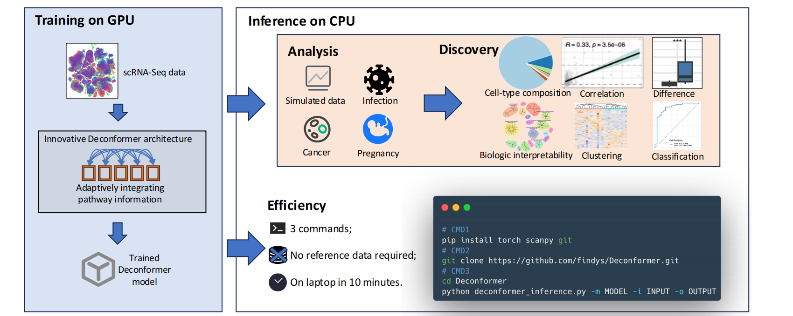
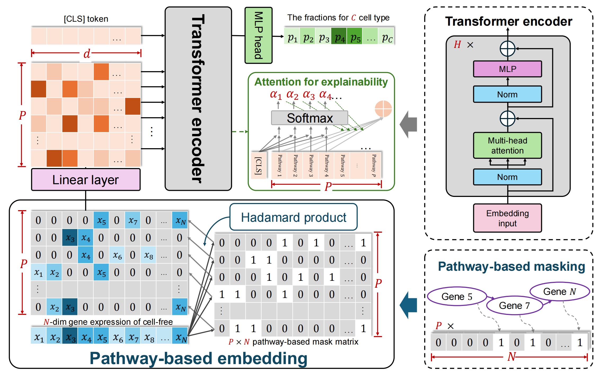
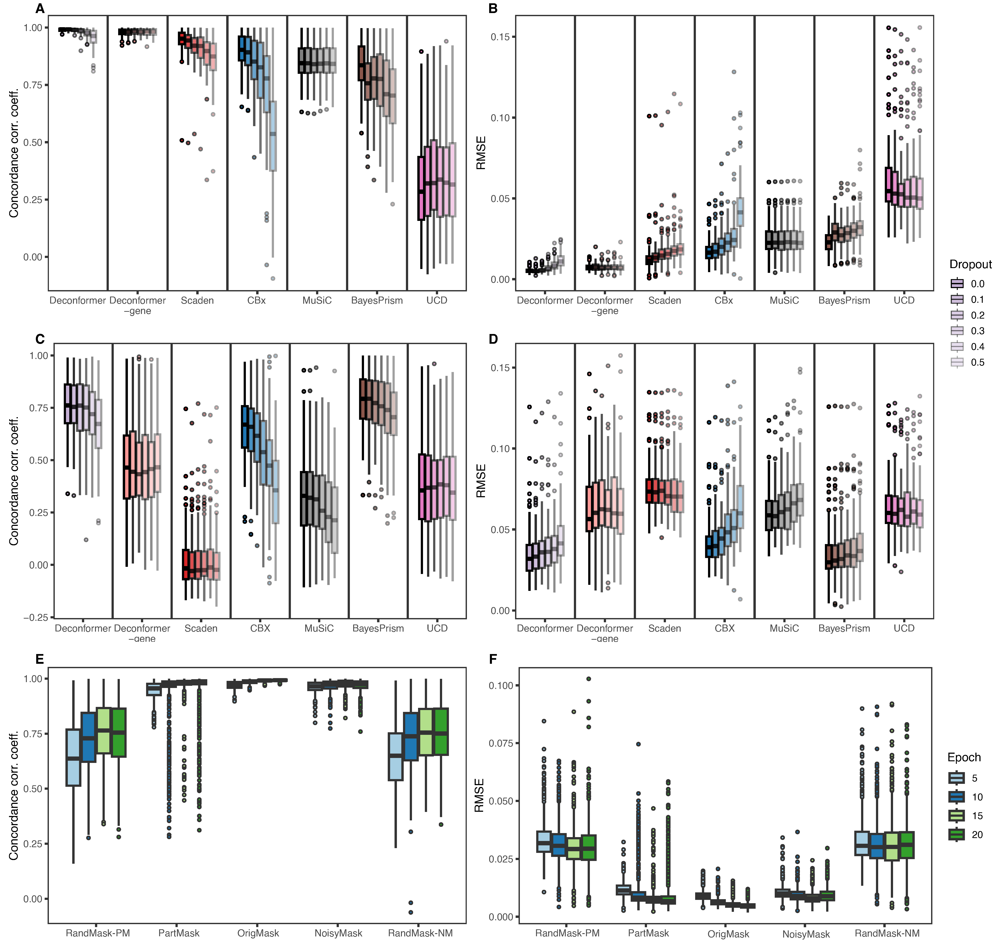
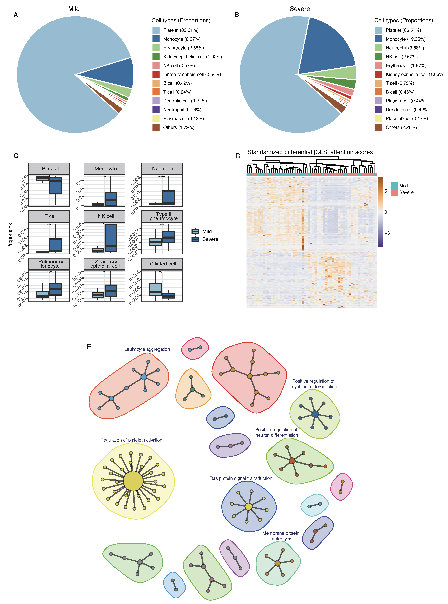
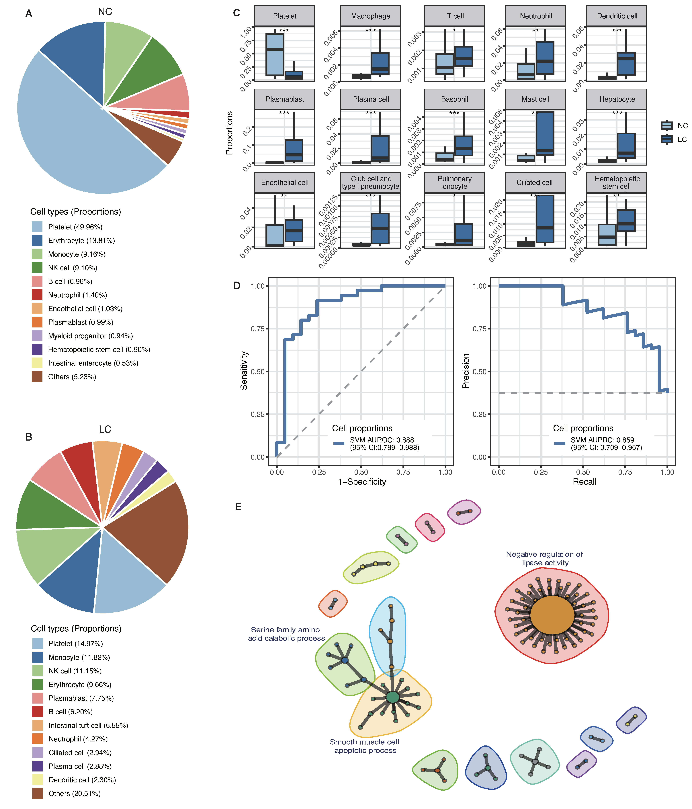
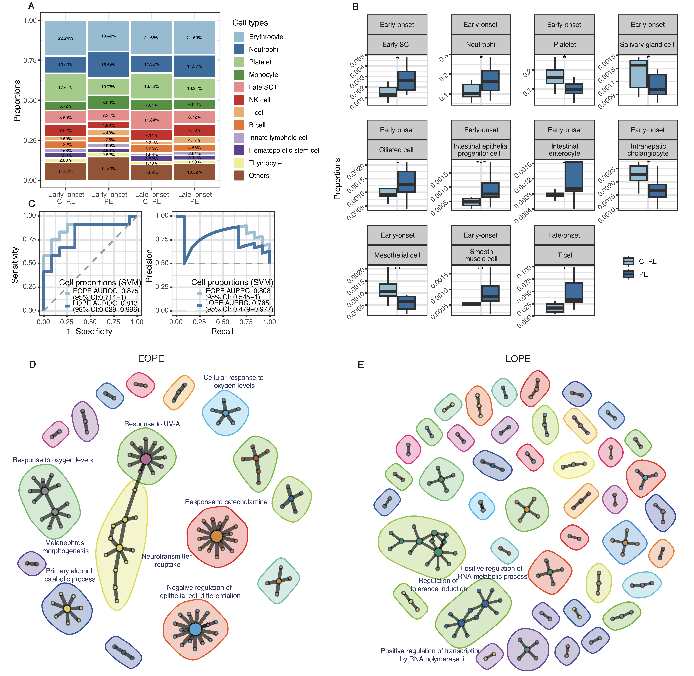
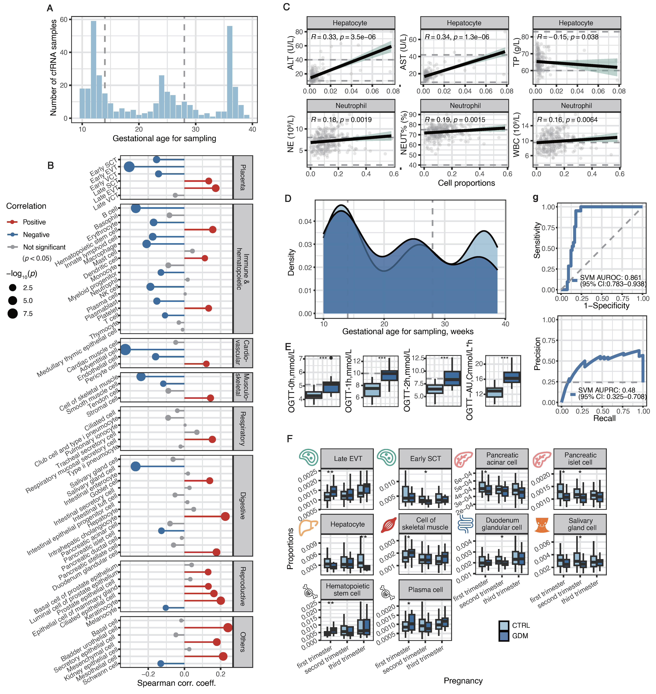

# Deconformer: efficient cell-type composition profiling of cfRNA across diverse cell types

## Graphical abstract

## Background
- cfRNA holds significant potential for non-invasive liquid biopsy, but accurately resolving its diverse cellular origins remains computationally challenging.
- Traditional deconvolution tools face prohibitive runtime and memory constraints when profiling >30 cell types, forcing researchers to merge or downsample cell types.
- Existing deep learning methods operate as opaque "black boxes" with limited biological interpretability, unstable optimization, and high overfitting risk.
- **Deconformer** bridges these gaps by integrating biological pathway knowledge with an interpretable Transformer architecture, delivering efficient, robust, and transparent cfRNA cell-type profiling.

---

## Key Results

### 1. Pathway-Integrated Architecture & Superior Benchmarking Performance
- Maps gene expression onto biological pathways, utilizing a Transformer encoder to adaptively weigh pathway importance and output cell-type proportions alongside interpretable attention scores.
- Achieves near-perfect concordance (CCC > 0.99) and exceptional robustness to sequencing dropout in simulations across 60 cell types, significantly outperforming state-of-the-art traditional (CBx, MuSiC, BayesPrism) and deep learning (Scaden, UCD) methods.
- **Validates cross-platform generalization by rigorously testing models trained on 10x Genomics references against Smart-seq2 simulated inputs, maintaining high accuracy where gene-level and black-box models degrade.**
- Ablation studies confirm that biologically grounded pathway masking is critical, as random masks severely degrade performance, while the framework delivers superior accuracy with minimal inference costs.

> **Figure 1. Overview of the Deconformer architecture.** Input gene expression profiles are mapped onto biological pathways via a mask matrix, transformed through a linear layer, and aggregated with a learnable `[CLS]` token. Multi-head self-attention adaptively weights pathway importance, and the updated `[CLS]` representation is projected via a fully connected layer and softmax to output precise cell-type fractions.

> **Figure 2. Benchmarking accuracy, robustness, and cross-platform generalization on simulated cfRNA data.** (A–D) Performance comparison across deconvolution methods using 10x Genomics (A–B) and Smart-seq2 (C–D) simulated test sets trained on 10x references. (E–F) Impact of pathway mask perturbations (information loss, noise injection) versus random masks on model performance (CCC and RMSE), validating the necessity of biologically grounded pathway integration.

### 2. Resolution of COVID-19 Severity-Specific Cellular Dynamics
- Captures pathophysiological shifts in COVID-19 plasma cfRNA, including reduced platelet contributions and elevated monocyte, neutrophil, and lung epithelial cell fractions in severe cases.
- Effectively stratifies mild and severe cohorts via unsupervised clustering of differential pathway attention scores.
- Differential attention analysis identifies biologically validated pathway interactions driving severity, notably dysregulation in platelet activation, RAS signaling, and leukocyte aggregation, confirming the model captures genuine disease biology.

> **Figure 3. Deconformer resolves disease-specific cellular and pathway dynamics in COVID-19 severity.** (A–B) Inferred cell-type compositions in mild and severe cohorts. (C) Significant compositional shifts highlighting platelet depletion and immune/lung cell elevation in severe cases. (D) Unsupervised clustering of `[CLS]` attention scores effectively stratifies disease severity. (E) Top 100 dysregulated pathway interactions ranked by Cohen’s *d*, revealing biologically relevant mechanisms (e.g., platelet activation, RAS signaling).

### 3. Characterization of Liver Cancer Microenvironment & Diagnostic Potential
- Identifies distinct liver cancer cfRNA signatures marked by decreased platelet fractions and increased contributions from immune cells, hepatocytes, and metastasis-associated cell types.
- Enables robust binary classification of cancer patients from controls (AUROC = 0.888) based solely on inferred cellular profiles.
- Pathway attention weights highlight clinically relevant dysregulated processes, including lipid metabolism, smooth muscle apoptosis, and serine catabolism, directly linking cellular dynamics to tumor pathophysiology.

> **Figure 4. Deconformer characterizes liver cancer microenvironment and enables non-invasive classification.** (A–B) Cellular composition profiles in non-cancer controls versus liver cancer patients. (C) Significant increases in hepatocytes, immune subsets, and metastasis-associated cells. (D) High discriminative performance (AUROC = 0.888) using cellular profiles for binary classification. (E) Pathway attention analysis highlights tumor-relevant processes, including lipid metabolism dysregulation and smooth muscle apoptosis.

### 4. Preeclampsia Profiling with Deconformer-p
- Integrates first- and third-trimester trophoblast references into **Deconformer-p**, accurately distinguishing transcriptionally similar trophoblast subtypes (>1,000-fold resolution).
- Characterizes preeclampsia (PE)-specific alterations: early-onset PE shows elevated early syncytiotrophoblasts and neutrophils with reduced platelets, while late-onset PE exhibits distinct T cell shifts.
- Classifiers trained on these profiles achieve high diagnostic accuracy (EOPE AUROC = 0.875; LOPE AUROC = 0.813), with pathway attention networks aligning with established PE pathogenesis.

> **Figure 5. Deconformer-p resolves placental trophoblast subtypes and characterizes preeclampsia pathophysiology.** (A–B) Cellular origin profiles in early-onset (EOPE) and late-onset (LOPE) preeclampsia versus controls, showing distinct trophoblast and immune shifts. (C) Robust classification performance for PE subtypes. (D–E) Differential pathway attention networks identify PE-specific biological processes, aligning with established pathogenesis mechanisms for EOPE and LOPE.

### 5. Longitudinal Pregnancy Tracking & Early GDM Prediction
- Accurately tracks gestational cellular trajectories in a prospective cohort (233 women, 389 samples), capturing progressive trophoblast evolution and pregnancy-induced immune suppression.
- Detects first-trimester GDM-associated alterations in trophoblast, pancreatic acinar/islet, hepatocyte, and skeletal muscle contributions.
- A first-trimester cellular profile classifier successfully predicts subsequent GDM development (AUROC = 0.861), establishing strong potential for early clinical risk stratification before standard diagnostic windows.

> **Figure 6. Longitudinal tracking of pregnancy dynamics and early prediction of gestational diabetes (GDM).** (A–C) Deconformer-p captures gestational cell-type trajectories, correlating with sampling time and clinical liver/neutrophil markers. (D–E) Cohort stratification and OGTT clinical differences between control and GDM groups. (F) Trimester-specific cellular alterations in GDM, including pancreatic, metabolic, and trophoblast shifts. (G) First-trimester cellular profile classifier successfully predicts GDM risk (AUROC = 0.861) prior to standard diagnosis.

---

## Conclusion
- Establishes a new benchmark for cfRNA deconvolution by seamlessly merging biological pathway priors with efficient, interpretable deep learning.
- Combines high accuracy, cross-platform robustness, computational efficiency, and built-in biological interpretability for immediate adoption by both computational and wet-lab researchers.
- Successfully uncovers disease-specific cellular signatures and enables early prediction of pregnancy complications, providing a practical, out-of-the-box solution to accelerate large-scale liquid biopsy research and precision medicine applications.

## GitHub repository
GitHub repository: [findys/Deconformer](https://github.com/findys/Deconformer)